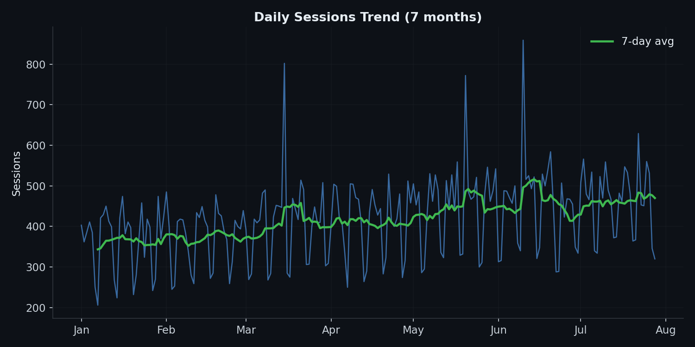
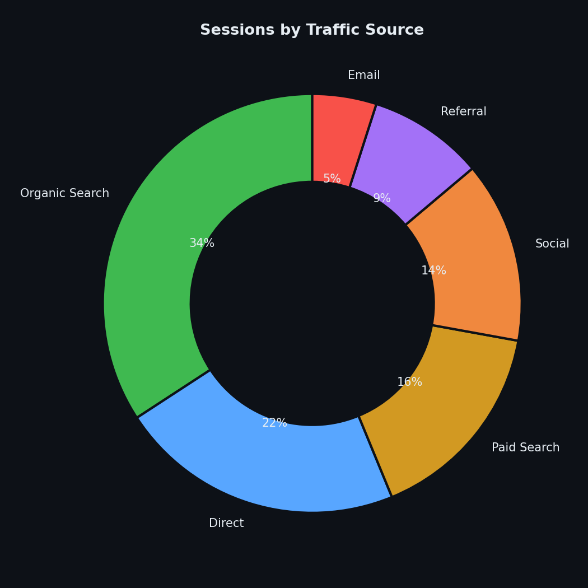
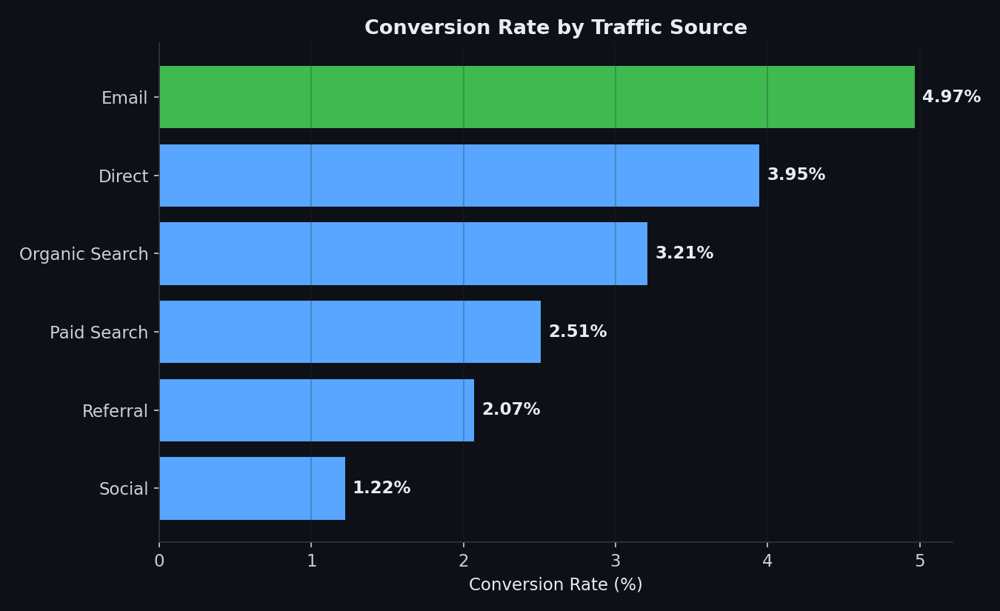
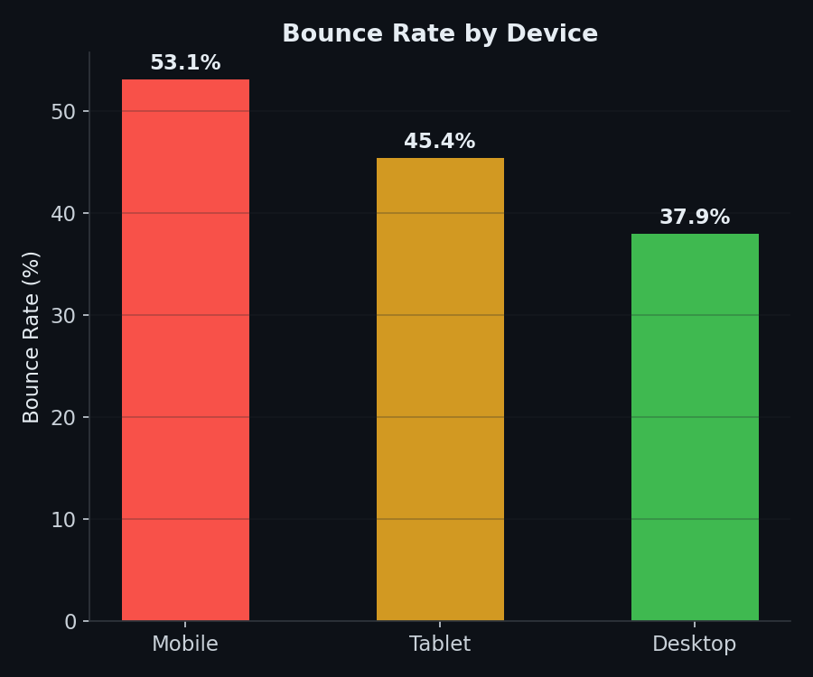

# Website Traffic Analysis (Power BI)

End-to-end web analytics project tracking user behavior and engagement
across ~88,000 simulated sessions over 7 months, modeled on a Google
Analytics-style session export (traffic source, device, country,
pageviews, bounce, conversion).

> **Note on data:** A live Google Analytics export requires an
> authenticated GA account and isn't reachable from this environment.
> `generate_data.py` builds a synthetic dataset with the same
> session-level structure and realistic, non-random relationships —
> weekday traffic higher than weekend, Email/Direct converting better
> than Social, Mobile bouncing more than Desktop, plus a gradual
> 7-month growth trend and a few campaign spikes. Swap in a real GA
> export (via BigQuery export or the GA Data API) and every
> measure/visual below works unchanged, provided column names match.

## Project Structure
```
powerbi-website-traffic/
├── generate_data.py           # builds website_sessions.csv
├── website_sessions.csv       # ~88K session rows, ready to import into Power BI
├── dax_measures.txt           # all DAX measures and calculated columns to paste in
├── dashboard_blueprint.md     # page-by-page layout: what visual goes where and why
├── dashboard_screenshot.png   # composed preview of the finished dashboard
├── images/                    # individual chart previews of key findings
└── README.md
```

## How to Build the Dashboard
1. Open Power BI Desktop → **Get Data** → **Text/CSV** → select `website_sessions.csv`
2. In **Power Query Editor**, confirm `Date` is typed as Date, `Pageviews`/`SessionDurationSec`/`IsBounce`/`Converted` as Whole Number
3. Load the data, then go to **Modeling → New Measure** and paste in each measure from `dax_measures.txt`
4. For `SessionQualityScore`, use **Modeling → New Column** instead (it's row-level, not an aggregation)
5. Follow `dashboard_blueprint.md` page by page to lay out visuals

## Key Tasks Covered
- Traffic trend analysis with 7-day moving average and month-over-month growth (DAX time intelligence via `DATEADD`)
- Traffic source and device breakdowns (sessions, bounce rate, conversion rate)
- A custom **Session Quality Score** (calculated column) blending pageviews, duration, conversion, and bounce into a single engagement metric
- Weekday vs. weekend traffic pattern comparison
- A source-performance scatter chart (bounce rate vs. conversion rate, sized by volume) designed to answer "where should marketing spend go" at a glance

## Insights (from actual data analysis)



- Traffic grew steadily over the 7-month window — **from ~11,350 sessions in January to a peak of ~14,100 in May** — with three visible campaign spikes layered on top of gradual organic growth.
- **Weekday sessions average 466/day vs. 299/day on weekends** — a 56% gap, meaning any campaign scheduling or server-capacity planning should weight weekdays heavily.



- **Organic Search drives the largest share of traffic (34%)**, followed by Direct (22%) and Paid Search (16%) — a healthy mix that isn't overly dependent on paid acquisition.



- **Email converts at 4.97%, more than 4x the rate of Social (1.22%)** — despite Email bringing in roughly 7x less traffic volume. This is the single clearest budget-reallocation insight in the dataset: Social is a volume channel, Email is a value channel.
- Direct traffic (3.95%) and Organic Search (3.21%) also convert well above the Paid Search baseline (2.51%), suggesting paid acquisition here isn't yet matching organic quality.



- **Mobile bounces at 53.1% vs. 37.9% for Desktop** — a 15-point gap that's large enough to flag a mobile UX or page-speed issue worth investigating, especially since Mobile and Desktop each carry roughly equal session volume (41K vs 40K).

## Suggested Next Steps
- Add a funnel visual (Session → Engaged → Converted) to show drop-off at each stage per traffic source.
- Layer in a "days since last campaign spike" calculated column to measure how long campaign lift actually persists.
- Swap in a real GA export when available — schema and all measures apply unchanged, provided column names match.
